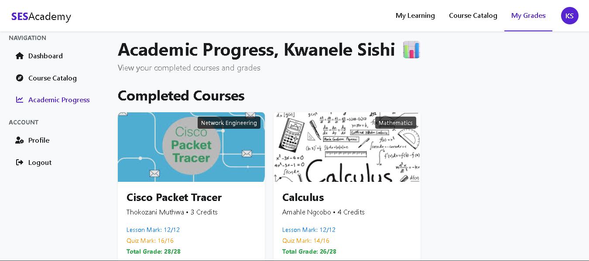

# Student Enrollment System (SES) - SESAcademy

## Overview

The **Student Enrollment System (SES)**, branded as SESAcademy, is a web-based platform designed to facilitate course enrollment, learning, and academic progress tracking for students and instructors. Built with PHP, MySQL, and hosted on a WAMP server, SES provides a robust system for managing online education. Key features include concurrent enrollment handling, quiz submissions, lesson management, and GPA calculation, ensuring a seamless experience for multiple users across different devices.

The system implements **pessimistic and optimistic locking** to manage simultaneous updates (e.g., course enrollments, quiz submissions), ensuring data integrity. It also resolves session conflicts across browser tabs, making it suitable for real-world usage. SES is currently in development as of May 15, 2025, and is designed to scale for deployment on live servers.

## Features

- **User Roles:** Supports students and instructors with role-based access.
- **Course Enrollment:** Students can enroll in courses with capacity limits, handled by pessimistic locking to prevent over-enrollment.
- **Lesson Management:** Instructors can manage course content (lessons, YouTube URLs, notes) with optimistic locking to prevent concurrent update conflicts.
- **Quiz System:** Students can take quizzes, with scores contributing to a total grade, protected by optimistic locking.
- **GPA Calculation:** Displays a weighted GPA on the student dashboard based on quiz scores and course credits.
- **Session Handling:** Resolves session conflicts across multiple browser tabs using tab-specific session IDs.
- **Responsive Design:** Uses Bootstrap and custom CSS for a user-friendly interface.

## Usage

1. **Login:**
   - Use `/index.php` to log in as a student or instructor.
   - To test multiple users in the same browser, open new tabs and append a unique `tabId` (e.g., `index.php?tabId=tab1`).

2. **Student Dashboard:**
   - View enrolled courses, completed courses, GPA, and credits earned.
   - Access courses via `Continue Learning` to view lessons and take quizzes.

3. **Instructor Dashboard:**
   - Manage course content (`manage_content.php`) and set quizzes (`set_quiz.php`).
   - Update lessons and quiz questions with conflict-free concurrency controls.

4. **Course Catalog:**
   - Students can browse and enroll in courses (`catalog.php`).
   - Enrollment is protected against over-capacity issues.

## Concurrency Controls

SES implements robust concurrency mechanisms to handle simultaneous updates:
- **Pessimistic Locking:** Used in `enroll.php` to lock course rows during enrollment, preventing over-enrollment.
- **Optimistic Locking:** Used in `submit_quiz.php` and `manage_content.php` with version columns to detect and resolve update conflicts.
- **Transaction Isolation:** Ensures atomic operations for critical updates (e.g., quiz submissions, lesson updates).

## Testing

- **Concurrency Testing:**
  - Simulate multiple students enrolling in a course with limited capacity using JMeter or multiple browser tabs.
  - Expected: Only the allowed number of students enroll; others receive a "Course full" message.
- **Multi-Tab Testing:**
  - Log in as different users in separate tabs with unique `tabId` parameters.
  - Expected: Each tab maintains its own session without interference.
- **GPA Calculation:**
  - Complete courses and quizzes, then check the dashboard for an updated GPA weighted by credits.

## Future Improvements

- Add lesson-based grading to contribute to the GPA.
- Implement a more granular GPA scale (e.g., A+, A-, etc.).
- Deploy to a live server for real-world multi-user testing.

## Screenshots

